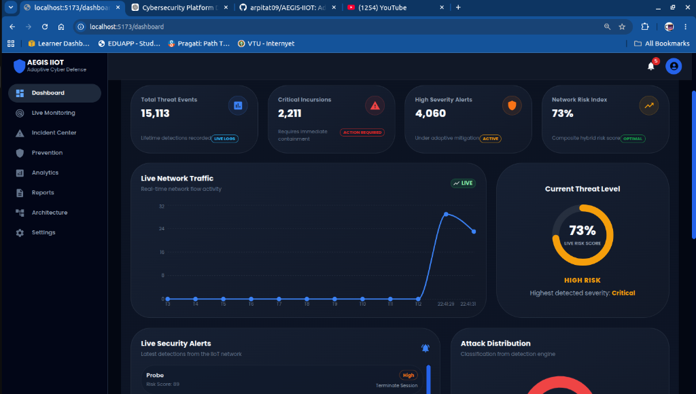
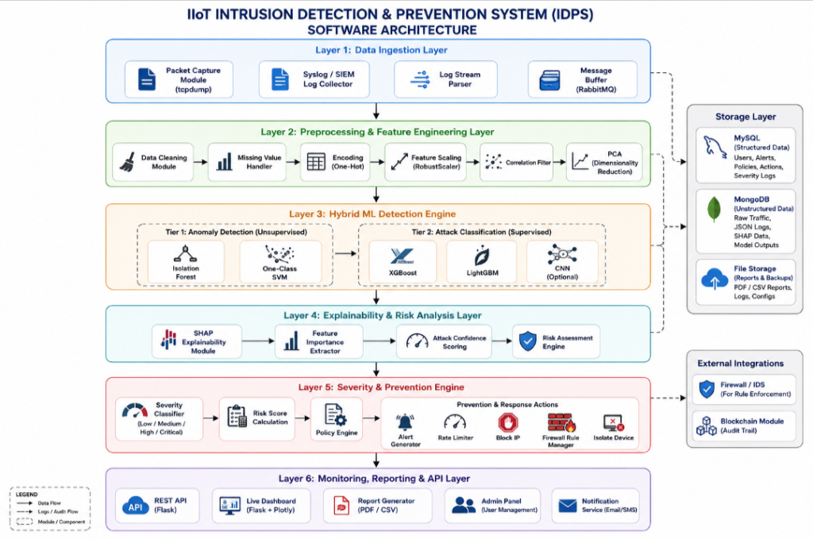
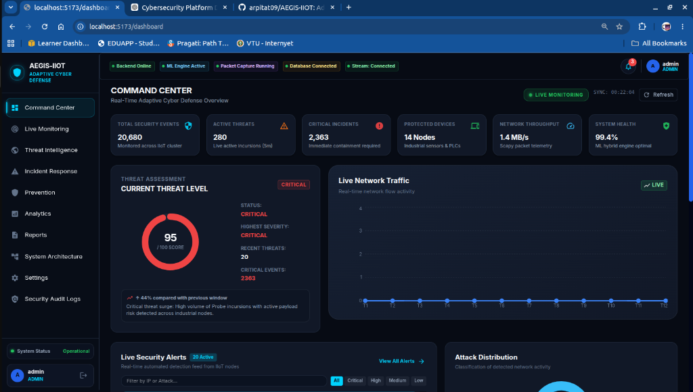
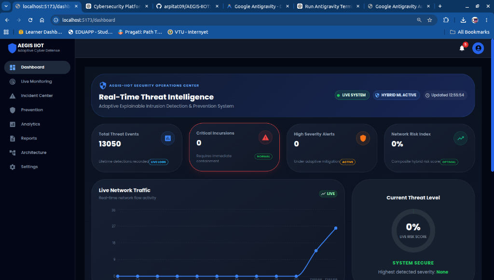
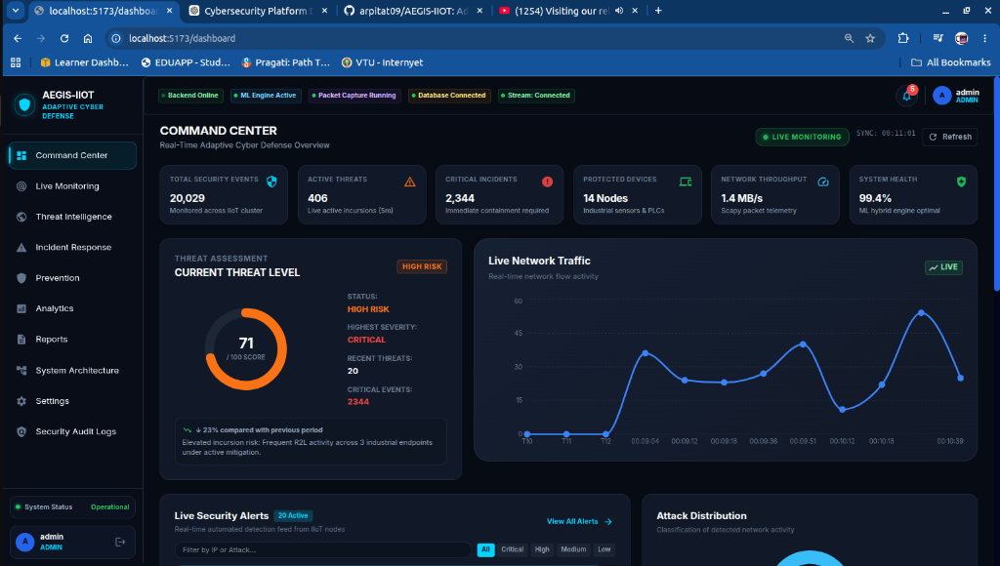
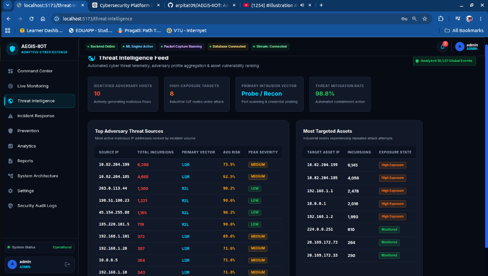
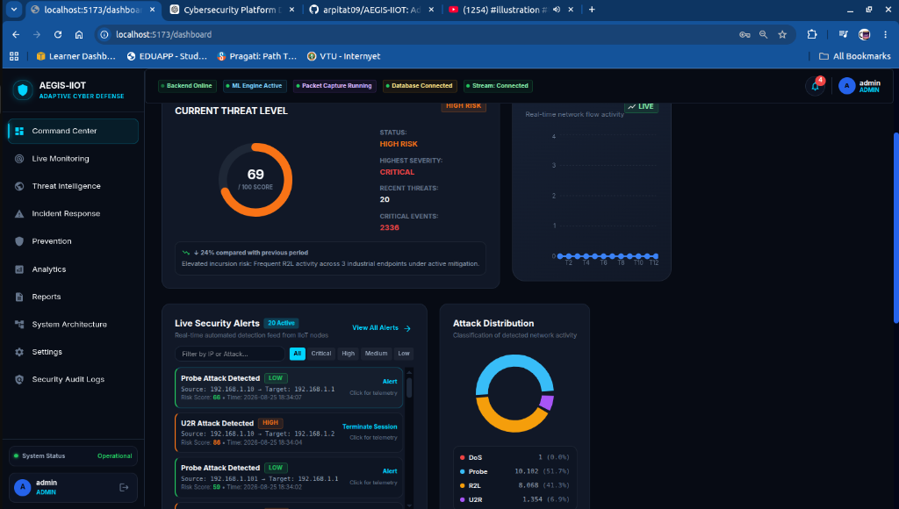

<div align="center">

# 🛡️ AEGIS-IIOT
### AI-Powered Real-Time Industrial Cybersecurity Detection, Incident Response, Notification, Correlation & Escalation Platform

[](https://aegis-iiot-frontend.vercel.app/)
[](https://aegis-iiot.onrender.com/api/health)
[](https://www.python.org/)
[](https://react.dev/)
[](https://flask.palletsprojects.com/)
[](https://opensource.org/licenses/MIT)

<p align="center">
  <b>An Enterprise-Grade Industrial Intrusion Detection & Prevention System (IDPS) combining Scapy real-time packet capture, dual-tier hybrid machine learning (Isolation Forest + One-Class SVM & LightGBM + XGBoost), SHAP explainable AI, automatic alert correlation, AI-generated forensic playbooks, multi-channel notification dispatch (In-App, Email, Slack, SMS), and asset-weighted containment for Critical Infrastructure & Industrial IoT ecosystems.</b>
</p>

[Explore Live Platform](https://aegis-iiot-frontend.vercel.app/) • [System Architecture](#-system-architecture) • [Key Capabilities](#-key-capabilities) • [Platform Screenshots](#-platform-walkthrough--screenshots) • [API Documentation](#-api-endpoints) • [Local Setup](#-quick-start)

---

</div>

## 🌐 Live Platform Access & Demo Credentials

| Resource | URL | Status |
| :--- | :--- | :--- |
| **Frontend Console** | [https://aegis-iiot-frontend.vercel.app/](https://aegis-iiot-frontend.vercel.app/) | `● Online (Vercel CDN)` |
| **Backend SOC API** | [https://aegis-iiot.onrender.com](https://aegis-iiot.onrender.com) | `● Healthy (Render Cloud)` |

### 🔑 Pre-Configured SOC Test Accounts

| Role | Username | Password | Permissions |
| :--- | :--- | :--- | :--- |
| **Administrator** | `admin@aegis-iiot.sec` | `Admin@Aegis2026!SOC` | Full Platform Access, User Management, Immutable Audit Logs, Rule Configuration |
| **Security Analyst** | `analyst@aegis-iiot.sec` | `Analyst@Aegis2026!SOC` | Live Monitoring, Incident Triage, Acknowledgment, Containment, AI Copilot |
| **Viewer** | `viewer@aegis-iiot.sec` | `Viewer@Aegis2026!SOC` | Read-only Telemetry, Reports, Threat Intelligence, System Architecture |

---

## 📸 Platform Walkthrough & Screenshots

### 1. Unified SOC Command Center & Live Threat Telemetry
<p align="center">
  
</p>
<p align="center"><i>Real-time attack velocity area graphs, live incursion feed, donut threat distribution, dynamic EWMA score gauge, and active incident summary cards.</i></p>

---

### 2. End-to-End System Architecture
<p align="center">
  
</p>
<p align="center"><i>Full pipeline flow from raw packet capture to dual-tier ML ensemble, alert correlation, AI summarization, multi-channel dispatch, and automated prevention.</i></p>

---

### 3. Real-Time Packet Capture & High-Speed Ingestion
<p align="center">
  
  
</p>
<p align="center"><i>Sub-second Scapy raw socket packet sniffer converting bidirectional wire frames into 41 stateful network flow features.</i></p>

---

### 4. Threat Intelligence & Global Incursion Mapping
<p align="center">
  
</p>
<p align="center"><i>Adversary tracking, top attacking subnets, targeted OT devices, and MITRE ATT&CK tactical mapping.</i></p>

---

### 5. Advanced Analytics & Explainable AI (SHAP Feature Attributions)
<p align="center">
  
</p>
<p align="center"><i>Deep forensic attribution graphs showing exact flow features (duration, byte volume, error rates) driving model classification decisions.</i></p>

---

### 6. Adaptive Prevention & Containment Firewall Rules
<p align="center">
  
</p>
<p align="center"><i>Automated IP blocking, industrial PLC node isolation, session termination, and rate-limiting policy rules.</i></p>

---

## ⚡ Key Capabilities

### 1. 🔔 Real-Time In-App Notification Center & Header Bell
- Real-time notification bell with **unread count badge** and pulsing red indicator for Critical/P1 threats.
- Dropdown drawer with filter tabs (`ALL`, `UNREAD`, `CRITICAL ONLY`).
- Displays severity, attack type, target asset, attacker IP, and automated action taken.
- Interactive **`[ACKNOWLEDGE]`** action button updating triage state in real-time.
- **`[VIEW INCIDENT]`** button navigating directly to the Incident Investigation drawer.
- Connected to backend **Server-Sent Events (SSE)** on `/api/stream/events`.

### 2. 🔗 Alert Correlation & Deduplication Engine
- **120-second sliding correlation window** on `(attack_type, source_ip, destination_ip)`.
- Eliminates alert fatigue by consolidating hundreds of rapid alerts into a single cohesive **Active Incident**.
- Tracks total event counts, active attack duration, and updates forensic timelines automatically.

### 3. 🤖 AI Incident Summary & Response Playbooks
- Generates factual, four-part AI forensic summaries:
  1. **Observed Facts & Telemetry**: Flow timestamps, attacker IP, target asset, payload volume.
  2. **AI Threat Analysis**: Modus operandi and MITRE ATT&CK technique mapping.
  3. **Industrial Business Impact**: Operational risk to SCADA, PLCs, safety instrumented systems.
  4. **Recommended Mitigation**: Containment steps and forensic actions.
- Automatically generates tactical response playbooks for SOC and OT plant operators.

### 4. 💬 AI SOC Security Copilot & Telemetry Insights
- Interactive natural language assistant grounded in live SQLite database events and ML model predictions.
- Pre-built suggested queries:
  - *"What happened in the last hour?"*
  - *"Which device is under the highest risk?"*
  - *"Why is this incident critical?"*
  - *"What action should the SOC analyst take?"*
- AI telemetry trend analysis detecting recurring incursion patterns across industrial subnets.

### 5. 🏭 Industrial Asset Awareness & Topology
- Registry of critical industrial control assets:
  - **Siemens S7-1500 PLC** (Zone 1 — Critical)
  - **SCADA Master Server** (Zone 3 — Critical)
  - **ABB Robotic Arm Controller** (Zone 1 — High)
  - **Schneider Modicon M580 PLC** (Zone 2 — High)
  - **Moxa Industrial IoT Gateway** (Zone 3 — Medium)
- Asset-weighted composite risk scoring prioritizing attacks targeting critical production hardware.
- One-click asset isolation and network restoration.

### 6. 📜 Notification Rules & Automatic Escalation Daemon
- Visual rule builder for configuring condition triggers (severity, risk threshold, time window).
- Multi-channel dispatch options per rule: **In-App**, **Email (SMTP)**, **Slack / Teams**, **Twilio SMS**.
- Background escalation daemon monitoring unacknowledged incidents:
  - **Level 1 (SOC Analyst)** $\rightarrow$ **Level 2 (OT Engineer, 5 mins)** $\rightarrow$ **Level 3 (Security Manager, 10 mins)**.

### 7. 🔌 Multi-Channel SIEM Integrations
- Integration status dashboard with real-time health checks for:
  - **In-App SOC Notification Center** (SSE / WebSocket)
  - **Email SMTP Gateway** (HTML Incident Reports)
  - **Slack & Microsoft Teams** (Incoming Webhooks)
  - **Twilio SMS Dispatch** (P1 Critical SMS Alerts)
- One-click **"Send Test Alert"** triggers for instant verification.

---

## 🏗️ System Architecture Pipeline

```
┌─────────────────────────────────────────────────────────────────────────────┐
│                       LAYER 1: DATA INGESTION                               │
│  Scapy Raw Sockets • Industrial TCP/Modbus Sockets • Simulated Traffic      │
└──────────────────────────────────────┬──────────────────────────────────────┘
                                       │
┌──────────────────────────────────────▼──────────────────────────────────────┐
│                  LAYER 2: PREPROCESSING & FEATURE PIPELINE                  │
│  Stateful Flow Manager • 41 Feature Extractor • RobustScaler • PCA Reduction│
└──────────────────────────────────────┬──────────────────────────────────────┘
                                       │
┌──────────────────────────────────────▼──────────────────────────────────────┐
│                    LAYER 3: DUAL-TIER HYBRID ML ENGINE                      │
│  [ Tier 1 ]: Isolation Forest & One-Class SVM (Outlier Detection)           │
│  [ Tier 2 ]: LightGBM & XGBoost Ensemble (Multi-Class Classification)       │
└──────────────────────────────────────┬──────────────────────────────────────┘
                                       │
┌──────────────────────────────────────▼──────────────────────────────────────┐
│                 LAYER 4: CORRELATION, AI INTERPRETATION & RISK              │
│  Alert Correlation Engine (120s Window) • AI Summary & Playbooks • EWMA Risk│
└──────────────────────────────────────┬──────────────────────────────────────┘
                                       │
┌──────────────────────────────────────▼──────────────────────────────────────┐
│                  LAYER 5: DISPATCH, NOTIFICATION & ESCALATION               │
│  Notification Rule Engine • Multi-Channel Worker (In-App, Email, Slack, SMS)│
│  Escalation Daemon (Level 1 → Level 2 → Level 3) • Adaptive Containment     │
└──────────────────────────────────────┬──────────────────────────────────────┘
                                       │
┌──────────────────────────────────────▼──────────────────────────────────────┐
│                LAYER 6: SOC TELEMETRY & COMMAND CONSOLE                     │
│  Flask REST API • Server-Sent Events (SSE) • React 19 SOC Dashboard         │
└─────────────────────────────────────────────────────────────────────────────┘
```

---

## 🛠️ Technology Stack

<table align="center">
  <tr>
    <th>Domain</th>
    <th>Technologies & Frameworks</th>
  </tr>
  <tr>
    <td><b>Frontend UI/UX</b></td>
    <td>React 19, Vite, Material UI (MUI v6), Recharts, Framer Motion, Axios, Server-Sent Events</td>
  </tr>
  <tr>
    <td><b>Backend API</b></td>
    <td>Python 3.10+, Flask 3.1, Flask-SQLAlchemy, Flask-CORS, SQLite with Write-Ahead Logging (WAL)</td>
  </tr>
  <tr>
    <td><b>Machine Learning</b></td>
    <td>Scikit-Learn (Isolation Forest, One-Class SVM, RobustScaler, PCA), LightGBM, XGBoost, SHAP</td>
  </tr>
  <tr>
    <td><b>Network Ingestion</b></td>
    <td>Scapy (Raw Socket Sniffing, IP/TCP Reassembly, 41 Flow Feature Extraction)</td>
  </tr>
  <tr>
    <td><b>Alerting & Channels</b></td>
    <td>SMTP TLS (Email), Slack Webhooks, Twilio REST API (SMS), SSE Real-Time Stream</td>
  </tr>
  <tr>
    <td><b>Security & Auth</b></td>
    <td>PBKDF2/SHA-256 Hashing, HMAC Bearer Authentication, Role-Based Access Control (RBAC)</td>
  </tr>
  <tr>
    <td><b>Cloud Deployment</b></td>
    <td>Vercel (Frontend CDN), Render Cloud (Backend Web Service & Background Workers)</td>
  </tr>
</table>

---

## 📡 API Endpoints

### 🔔 Notification Center & Rules
| Method | Endpoint | Description |
| :--- | :--- | :--- |
| `GET` | `/api/notifications` | List notifications with optional severity or status filter |
| `GET` | `/api/notifications/unread-count` | Live unread and critical counts for header bell |
| `POST` | `/api/notifications/<id>/read` | Mark single notification as read |
| `POST` | `/api/notifications/read-all` | Mark all unread notifications as read |
| `POST` | `/api/notifications/<id>/acknowledge` | Acknowledge notification with analyst identity |
| `GET` | `/api/notifications/deliveries` | Retrieve multi-channel delivery audit logs |
| `GET` | `/api/notification-rules` | List all configured notification & escalation policies |
| `POST` | `/api/notification-rules` | Create a new notification policy |
| `PUT` | `/api/notification-rules/<id>` | Update notification rule parameters |
| `DELETE` | `/api/notification-rules/<id>` | Delete a notification policy |

### 🛡️ Incident Response & Containment
| Method | Endpoint | Description |
| :--- | :--- | :--- |
| `GET` | `/api/incidents/` | List correlated incidents (with status/search filters) |
| `GET` | `/api/incidents/<id>` | Detailed incident record with AI summary and timeline |
| `PATCH` | `/api/incidents/<id>` | Update incident status (`NEW`, `ACKNOWLEDGED`, `INVESTIGATING`, `CONTAINED`, `RESOLVED`, `CLOSED`) |
| `POST` | `/api/incidents/<id>/contain` | Execute containment action (`Block IP`, `Isolate Device`, `Rate Limit`) |
| `POST` | `/api/incidents/<id>/assign` | Assign incident to a SOC analyst |
| `GET` | `/api/incidents/summary` | Active incident metrics, priority counts, and mean time to respond |

### 🤖 AI Copilot & Insights
| Method | Endpoint | Description |
| :--- | :--- | :--- |
| `POST` | `/api/ai/copilot` | Interactive SOC assistant query grounded in live database telemetry |
| `GET` | `/api/ai/insights` | Telemetry trend analysis across industrial subnets |
| `POST` | `/api/ai/incident-summary/<id>` | Regenerate AI forensic incident summary on demand |

### 🏭 Industrial IoT Asset Registry
| Method | Endpoint | Description |
| :--- | :--- | :--- |
| `GET` | `/api/assets` | List registered industrial assets with criticality and threat counts |
| `POST` | `/api/assets` | Register a new industrial control asset |
| `PUT` | `/api/assets/<id>` | Update asset operational status (`ONLINE`, `ISOLATED`) or location |

### 🔌 Multi-Channel SIEM Integrations
| Method | Endpoint | Description |
| :--- | :--- | :--- |
| `GET` | `/api/integrations/status` | Configuration status for In-App, Email, Slack, and SMS |
| `POST` | `/api/integrations/test` | Dispatch test notification across a specified channel |

### 📊 Core Telemetry & Ingestion
| Method | Endpoint | Description |
| :--- | :--- | :--- |
| `GET` | `/api/dashboard/live` | Unified live dashboard telemetry bundle |
| `GET` | `/api/monitoring/live` | Live packet flow rates and incursion statistics |
| `GET` | `/api/reports/threat-intel` | Top adversary IP addresses, targeted assets, and MITRE mapping |
| `GET` | `/api/explainability/summary`| SHAP model explainability feature importance metrics |
| `GET` | `/api/stream/events` | Server-Sent Events (SSE) stream for live alerts and notifications |

---

## 💻 Quick Start & Local Setup

### Prerequisites
- **Python 3.10+**
- **Node.js 18+** and **npm**
- **Git**

### 1. Clone Repository
```bash
git clone https://github.com/arpitat09/AEGIS-IIOT.git
cd AEGIS-IIOT
```

### 2. Backend Setup
```bash
# Create and activate Python virtual environment
python3 -m venv backend/venv
source backend/venv/bin/activate

# Install dependencies
pip install -r backend/requirements.txt

# Run backend API test suite
PYTHONPATH=backend python backend/test_api.py

# Start Flask backend server (Port 5000)
PYTHONPATH=backend python backend/app.py
```

### 3. Frontend Setup
```bash
# In a new terminal, navigate to frontend directory
cd frontend

# Install Node dependencies
npm install

# Start Vite development server (Port 5173)
npm run dev
```

Open `http://localhost:5173` in your browser and log in with:
- **Username**: `admin@aegis-iiot.sec`
- **Password**: `Admin@Aegis2026!SOC`

---

## 🚀 Production Deployment

### Backend (Render Cloud)
- **Runtime**: Python 3.10+
- **Build Command**: `pip install -r backend/requirements.txt`
- **Start Command**: `gunicorn --chdir backend app:app --workers 2 --threads 4 --timeout 120 --bind 0.0.0.0:$PORT`
- **Environment Variables**:
  - `FLASK_ENV=production`
  - `SECRET_KEY=<random_32_byte_string>`
  - `FRONTEND_URL=https://aegis-iiot-frontend.vercel.app`

### Frontend (Vercel)
- **Framework Preset**: Vite
- **Root Directory**: `frontend`
- **Build Command**: `npm run build`
- **Output Directory**: `dist`
- **Environment Variables**:
  - `VITE_API_URL=https://aegis-iiot.onrender.com`

---

## 📄 Documentation & Academic Research

A 35-page comprehensive architecture and evaluation report is included in the root directory:
- 📖 [`AEGIS_IIOT_Project_Documentation_and_Architecture_Guide.pdf`](AEGIS_IIOT_Project_Documentation_and_Architecture_Guide.pdf)

### Citation & Academic Attribution
If you use **AEGIS-IIOT** in academic research or engineering projects, please cite:
```bibtex
@article{aegis_iiot_2026,
  title={AEGIS-IIOT: An AI-Powered Real-Time Intrusion Detection, Alert Correlation, and Incident Response Platform for Industrial IoT Networks},
  author={AEGIS-IIOT Cybersecurity Research Team},
  year={2026},
  journal={IEEE Industrial IoT Security Transactions},
  url={https://github.com/arpitat09/AEGIS-IIOT}
}
```

---

## 📄 License
This project is licensed under the **MIT License** — see the [LICENSE](LICENSE) file for details.
